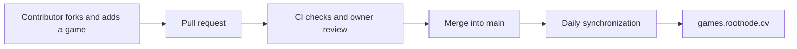

# Rootnode Games

An open catalogue of browser games: **https://games.rootnode.cv/**.
The catalogue currently includes Angry Balls, a mobile game with a level editor.

Anyone can fork this repository, add a game, and open a pull request. After CI passes, the owner approves the changes, and the PR is merged into `main`, the server publishes the game during the next daily update, between **04:00 and 04:15 UTC**. Unmerged pull requests are not deployed.



## Add a game

See [CONTRIBUTING.md](CONTRIBUTING.md) for instructions and the catalogue entry format. Start by copying `templates/game/` to `games/my-game/` and adding an entry to `games.json`. The catalogue automatically displays your game card. Ready-to-run static HTML/CSS/JavaScript/WebAssembly games are supported. Build your engine before submitting a PR and include the resulting browser files.

## Local preview

Requires Python 3.10 or newer. No third-party Python packages are needed.

```sh
python -m unittest discover -s tests -v
python scripts/build.py --output dist
python server/server.py --root dist/public --store .local/levels.json --host 127.0.0.1 --port 8090
```

Open `http://127.0.0.1:8090/`. For another build, use a new output directory or remove your previous `dist/` directory.

## Repository layout

- `games.json`: game cards and their order.
- `games/<slug>/`: source and browser files for each game.
- `site/`: the shared landing page, which reads the manifest without requiring HTML changes for new games.
- `scripts/build.py`: static file validation and packaging.
- `server/server.py`: static server and the Angry Balls level API.
- `ops/`: installation and daily synchronization; see [ops/README.md](ops/README.md) for deployment instructions.
- `.github/workflows/validate.yml`: CI for pull requests and main; `.github/CODEOWNERS`: owner review.

User-created levels are stored outside Git, at `/srv/games/data/angry-balls-levels.json` on the production server. Game updates preserve this file. The editor is currently open to everyone at the owner's request. The configuration for restoring authentication is saved in `ops/Caddyfile.games.protected`.

Project code is licensed under MIT. Games and third-party libraries retain their own licenses. The bundled p5.js 1.9.4 includes its LGPL-2.1 license and a link to its source code.
