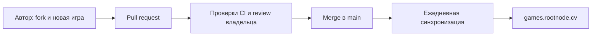

# Rootnode Games

Открытый каталог браузерных игр: **https://games.rootnode.cv/**.
Сейчас в каталоге Angry Balls с мобильным управлением и редактором уровней.

Любой автор может сделать fork, добавить игру и открыть pull request. После проверки CI, одобрения владельцем и слияния в `main` сервер опубликует игру при ближайшем ежедневном обновлении — между **04:00 и 04:15 UTC**. Изменения из непринятых PR на сервер не попадают.



## Добавить игру

Инструкция и формат записи — в [CONTRIBUTING.md](CONTRIBUTING.md). Для старта можно скопировать `templates/game/` в `games/my-game/` и добавить запись в `games.json`. Карточка появляется в каталоге автоматически. Поддерживаются готовые статические HTML/CSS/JavaScript/WebAssembly-игры; сборку своего движка нужно выполнить до PR и включить итоговые браузерные файлы.

## Локальная проверка

Требуется Python 3.10+; внешние Python-зависимости не нужны.

```sh
python -m unittest discover -s tests -v
python scripts/build.py --output dist
python server/server.py --root dist/public --store .local/levels.json --host 127.0.0.1 --port 8090
```

Откройте `http://127.0.0.1:8090/`. Перед повторной сборкой используйте новую выходную директорию либо удалите свою предыдущую `dist/`.

## Структура

- `games.json` — порядок и карточки игр.
- `games/<slug>/` — исходные и готовые файлы конкретной игры.
- `site/` — общая стартовая страница; отображает manifest без правки HTML при добавлении игры.
- `scripts/build.py` — проверка и упаковка статических файлов.
- `server/server.py` — статический сервер и API уровней Angry Balls.
- `ops/` — установка и ежедневная синхронизация, описание развёртывания в [ops/README.md](ops/README.md).
- `.github/workflows/validate.yml` — CI для PR и main; `.github/CODEOWNERS` — review владельца.

Пользовательские уровни не хранятся в Git: на рабочем сервере они находятся в `/srv/games/data/angry-balls-levels.json`. Обновление игр не заменяет этот файл. Редактор сейчас открыт всем по решению владельца; конфигурация возвращения защиты сохранена в `ops/Caddyfile.games.protected`.

Лицензия собственного кода: MIT. Игры и сторонние библиотеки сохраняют свои лицензии; p5.js 1.9.4 распространяется вместе с LGPL-2.1 и ссылкой на исходный код.
